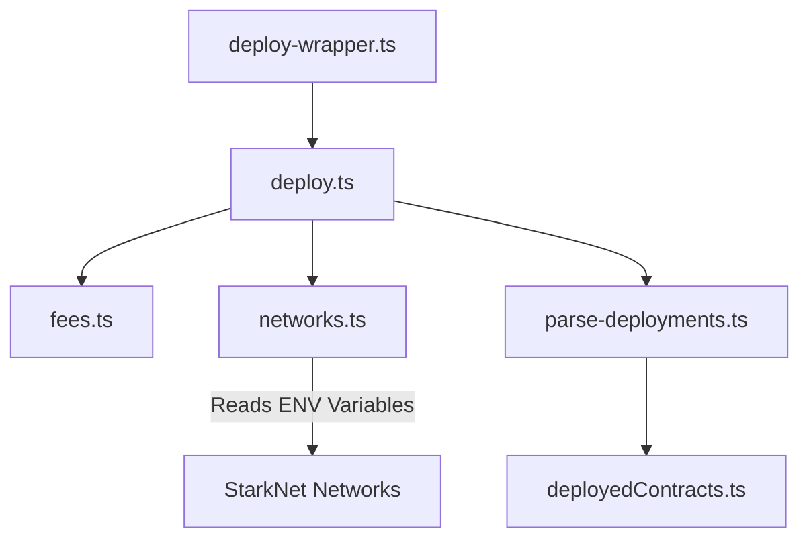

# Helpers Directory

The **`helpers`** directory contains utility scripts that facilitate the deployment, interaction, and management of StarkNet smart contracts within the CofiBlocks project. These scripts help streamline workflows and ensure consistency across networks.

---

## Scripts and Commands

### 1. `colorize-log.ts`

**Purpose**:  
This script adds colored logging functionality for better visibility of messages in the terminal (e.g., errors, warnings, and success messages).

**Key Features**:
- Defines ANSI escape codes for terminal colors.
- Provides helper functions to format messages with colors like **red**, **green**, and **yellow**.

**How It Works**:
```typescript
export const red = (message: string): string => colorize(colors.red, message);
export const green = (message: string): string =>
	colorize(colors.green, message);
```

**Usage Example**:
```typescript
import { red, green, yellow } from "./colorize-log";

console.log(green("✅ Success: Contracts deployed successfully!"));
console.log(red("❌ Error: Failed to fetch balance."));
console.log(yellow("⚠️ Warning: Balance is low."));
```
---

### 2. `deploy-wrapper.ts`
**Purpose**:
A wrapper script to automate and simplify the deployment process for smart contracts.

**Key Features**:
- Accepts command-line arguments using yargs for network selection, fee token options, and reset deployment states.
- Sets relevant environment variables before triggering the main deployment script.
  
**Command Options**:
| **Option**      | **Description**                                     | **Default** |
|-----------------|-----------------------------------------------------|-------------|
| `--network`     | Specifies the network to deploy to                  | `devnet`    |
| `--fee`         | Sets the fee token ( `eth` or `strk` )              | `eth`       |
| `--reset`       | Keeps existing deployments ( `true` / `false` )     | `true`      |

**How it works**
```bash
# Example command to deploy on Sepolia with STRK fees
ts-node deploy-wrapper.ts --network sepolia --fee strk --reset false
```

**Interaction**:
The `deploy-wrapper.ts` script executes multiple tasks
  1. Builds contracts using **Scarb**. 
  2. Deploys contracts using the main `deploy.ts` script.
  3. Parses deployments with `parse-deployments.ts`.

---

### 3. `fees.ts`

**Purpose**:
Manages fee token selection and checks balances to ensure sufficient funds for transactions.

**Key Features**:
- Fetches ERC-20 token balances for the deployer account.
- Chooses the optimal fee token (`ETH` or `STRK`) based on balance availability.
- Handles transaction versioning for StarkNet contracts.
  
```typescript
const specifiedToken = feeTokenOptions.find(
	(token) => token.name === feeToken,
);

if (specifiedToken) {
	const balance = await getBalance(deployer.address, provider, specifiedToken.address);
	if (balance > 0n) {
		return getTxVersionFromFeeToken(feeToken, isSierra);
	}
}
```
**Usage Example**:
```typescript
import { getTxVersion } from "./fees";

const version = await getTxVersion(networkConfig, "eth");
console.log(`✅ Transaction Version: ${version}`);
```

---

### 4. `networks.ts`

**Purpose**:
Manages network configurations for Devnet, Sepolia, and Mainnet, including RPC providers, deployer accounts, and fee token options.

**Key Features**:
- Reads configuration values from environment variables using dotenv.
- Exports pre-configured network objects for use in scripts.

**Network Configuration Snippet**:
```typescript
const providerDevnet = new RpcProvider({ nodeUrl: "http://127.0.0.1:5050" });
const deployerDevnet = new Account(providerDevnet, ACCOUNT_ADDRESS_DEVNET, PRIVATE_KEY_DEVNET, "1");

export const networks = {
	devnet: {
		provider: providerDevnet,
		deployer: deployerDevnet,
		feeToken: [
			{ name: "eth", address: ETH_TOKEN_ADDRESS_DEVNET },
			{ name: "strk", address: STRK_TOKEN_ADDRESS_DEVNET },
		],
	},
};
```
**Usage**:
```typescript
import { networks } from "./networks";

const devnetProvider = networks.devnet.provider;
const deployerAccount = networks.devnet.deployer;
```

---

### 5. `parse-deployments.ts`

**Purpose**:
Parses deployment JSON files and generates a TypeScript file (`deployedContracts.ts`) containing contract addresses and ABIs.

**Key Features**:
- Reads deployment outputs (e.g., *`_latest.json`).
- Extracts contract addresses and ABIs.
- Outputs a formatted TypeScript file for easy integration
  
**How It Works**:
- Reads deployment files.
- Extracts contract data.
- Generates a `deployedContracts.ts` file with all relevant data.

```typescript
const formattedContent = await prettier.format(
	`${generatedContractComment}\n\nexport default deployedContracts;`,
	{ parser: "typescript" },
);

fs.writeFileSync(
	path.join(TARGET_DIR, "deployedContracts.ts"),
	formattedContent,
);
```
**Run the Script**:
```bash
ts-node parse-deployments.ts
```

**Generated Output**: The output file `deployedContracts.ts` will look like:

```ts
export default {
	"devnet": {
		"ExampleContract": {
			"address": "0x1234...",
			"abi": [ ... ],
			"classHash": "0x5678..."
		}
	}
} as const;
```

---

The helper scripts interact in the following flow:




- `deploy-wrapper.ts`: Entry point for deployment.
- `deploy.ts`: Deploys the contracts.
- `fees.ts`: Handles fee token selection.
- `networks.ts`: Provides network configurations.
- `parse-deployments.ts`: Generates contract output files.

---


### Development Guidelines
- Follow TypeScript standards for type safety and clean code.
- Use Biome or ESLint for linting and formatting consistency.
- Log outputs clearly using `colorize-log.ts`.
- Modularize reusable functions to enhance maintainability.

---

### Testing Directory and Standards
To test scripts or helper functions:
  1. Unit Testing: Write tests for individual functions (e.g., fee token selection).
  2. Integration Testing: Test workflows combining multiple scripts.

Example Unit Test (for `fees.ts`):
```ts
import { getBalance } from "./fees";
import { expect } from "chai";

describe("getBalance", () => {
	it("should return the correct balance", async () => {
		const mockProvider = { callContract: async () => ({ balance: { low: 10n, high: 0n } }) };
		const balance = await getBalance("0x1234", mockProvider, "0xTokenAddress");
		expect(balance).to.equal(10n);
	});
});
```

**Run tests using**:
```bash
npm test
```


