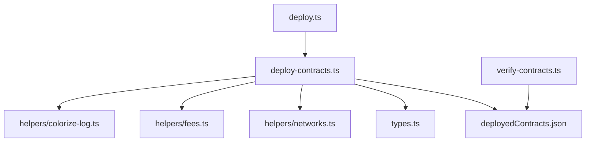

# Scripts-TS Directory

The `scripts-ts` directory contains essential TypeScript scripts for managing the deployment, verification, and interaction of smart contracts on the StarkNet network. These scripts streamline processes like deploying contracts, verifying deployments, and managing networks efficiently.

---

## Scripts and Commands

Below is a list of the key scripts in this folder, their purpose, and usage.

---

### 1. `deploy-contracts.ts`

**Purpose**:  
Facilitates the **declaration** and **deployment** of StarkNet smart contracts. This script supports configurable networks, fee tokens, and resets previous deployments when required.

**Key Features**:
- Uses `yargs` to parse CLI arguments (e.g., `--network`, `--fee`).
- Declares and deploys contracts using Universal Deployer Contracts (UDC).
- Handles retries for network connectivity issues.

**Command Options**:

| Option       | Description                                  | Default   |
|--------------|----------------------------------------------|-----------|
| `--network`  | Specifies the network (e.g., `devnet`, `sepolia`) | Required  |
| `--fee`      | Sets the fee token (`eth` or `strk`)         | `eth`     |
| `--reset`    | Keeps or resets existing deployments         | `true`    |

**Usage**:
```bash
ts-node deploy-contracts.ts --network sepolia --fee eth --reset false
```

Deploys a contract with retries and error handling:

```ts
await deployContract({
	contract: "cofi_collection.cairo",
	contractName: "CofiCollection",
	constructorArgs: { owner: deployer.address },
	options: { maxFee: BigInt(1e12) },
});
```

---

### 2. `deploy.ts`

**Purpose**:
Acts as the main entry point for deploying specific smart contracts. This script calls `deploy-contracts.ts` functions to deploy contracts like `CofiCollection` and `Marketplace`.

**Key Features**:
- Deploys contracts sequentially with relevant constructor arguments.
- Executes deployment calls and exports deployment artifacts.

**How it works**:
```ts
await deployContract({
	contract: "Marketplace.cairo",
	contractName: "Marketplace",
	constructorArgs: {
		cofi_collection_address: deployer.address,
		cofi_vault_address: deployer.address,
		strk_contract: deployer.address,
		admin: deployer.address,
	},
});
```
**Usage**:
```bash
ts-node deploy.ts --network sepolia
```

**Output**:
```bash
🚀 Deploying with address: 0xYourAddress
✅ Contract Deployed at 0xContractAddress
✅ All Setup Done
```

---

### 3. `verify-contracts.ts`

**Purpose**:
Verifies deployed contracts on StarkNet using the `sncast` verify command.

**Key Features**:
Reads deployed contract details from `deployedContracts.ts`.
Verifies contracts on specified networks (`mainnet` or `sepolia`).

**Usage**:
```bash
ts-node verify-contracts.ts --network sepolia
```

**Snippet**:
Iterates through deployed contracts and runs the verification command:

```typescript
execSync(
	`sncast verify --contract-address ${address} --contract-name ${contract} --network ${network} --verifier walnut --confirm-verification`,
	{ stdio: "inherit" },
);
```

**Output**:
```bash
Verifying CofiCollection on sepolia...
✅ Successfully verified CofiCollection
```

---

### 4. `type.ts`

**Purpose**:
Defines reusable TypeScript types for deployment parameters and network configurations.

**Key Snippet**:
```typescript
export type DeployContractParams = {
	contract: string;
	contractName?: string;
	constructorArgs?: RawArgs;
	options?: UniversalDetails;
};
```
This ensures consistency across deployment scripts.

---

The following diagram explains the interaction between the scripts and components in this directory:


**Explanation**:
- `deploy.ts` calls `deploy-contracts.ts` to handle deployment logic.
- `helpers/ scripts` assist with logging (`colorize-log.ts`), fee management (`fees.ts`), and network setup (`networks.ts`).
- Deployment results are stored in `deployedContracts.json`.
- `verify-contracts.ts` uses these results for contract verification.

---

### Testing Directory and Standards

To test these scripts:

  1. Unit Tests:
     - Test individual helper functions (e.g., `getTxVersion`, `deployContract`).
  2. Integration Tests:
     - Simulate contract deployment on a local Devnet.
  3. Verification:
     - Use `verify-contracts.ts` to ensure successful deployment and verification.

Example Test (for `deployContract`):

```typescript
import { deployContract } from "./deploy-contracts";
import { expect } from "chai";

describe("Deploy Contract", () => {
	it("should deploy a contract successfully", async () => {
		const result = await deployContract({
			contract: "Example",
			constructorArgs: { owner: "0x123" },
		});
		expect(result.address).to.be.a("string");
	});
});
```

**Run Tests**:
```bash
npm test
```


