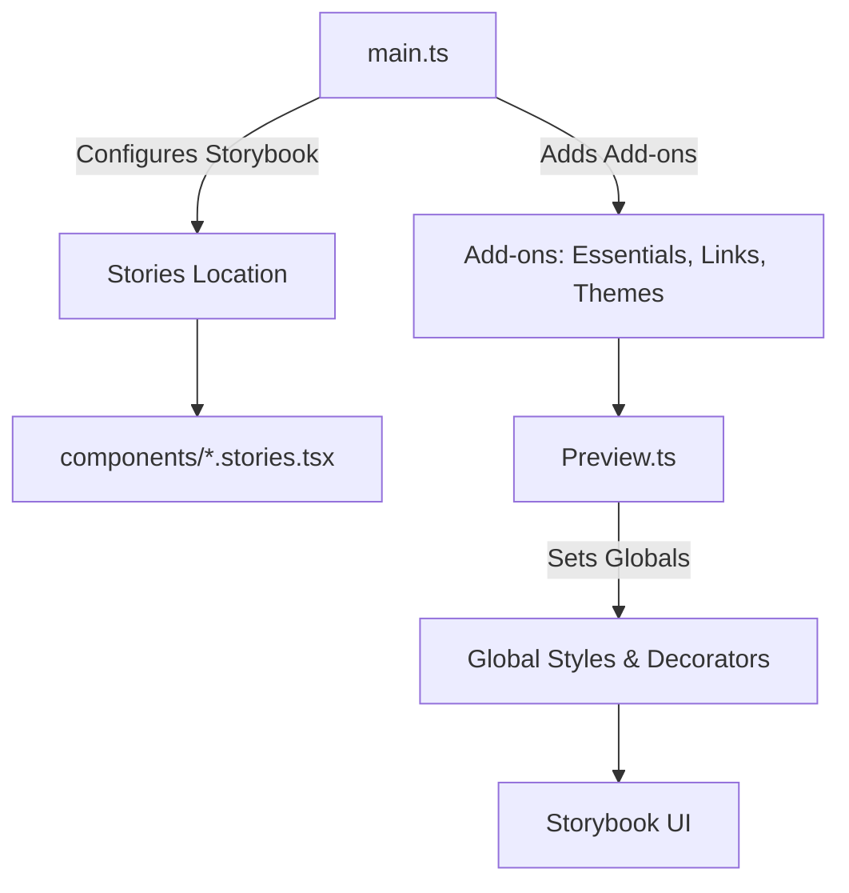

# Storybook Configuration (`.storybook/`)

The `.storybook` directory configures and customizes the Storybook environment for this project. Storybook is a tool used to build and test UI components in isolation, enabling developers to visualize and interact with components during development.

## File Breakdown
### 1. `main.ts`
The `main.ts` file serves as the core configuration file for Storybook. It specifies the essential settings, including:
- Framework configuration (`@storybook/nextjs`).
- Stories location (where Storybook should look for component stories).
- Add-ons to enhance Storybook functionality.

```typescript
import type { StorybookConfig } from '@storybook/nextjs';

const config: StorybookConfig = {
  stories: ['../src/**/*.stories.@(js|jsx|ts|tsx)'], // Path to story files
  addons: [
    '@storybook/addon-essentials', // Essential add-ons like controls, actions, docs, etc.
    '@storybook/addon-links',      // Enables linking between stories
    '@storybook/addon-interactions', // Adds interactivity testing
    '@storybook/addon-themes'      // Supports custom themes
  ],
  framework: {
    name: '@storybook/nextjs', // Framework integration for Next.js
    options: {}
  },
  docs: {
    autodocs: 'tag'
  },
};
export default config;
```

**Key Notes:**

- Stories Path: Storybook scans `../src/**/*.stories.@(js|jsx|ts|tsx)` for story files.
- Add-ons:
  - `@storybook/addon-essentials`: Provides core features like documentation, controls, and actions.
  - `@storybook/addon-interactions`: Adds support for testing component interactions.
  - `@storybook/addon-links`: Allows linking between stories.
  - `@storybook/addon-themes`: Adds theme switching functionality.

### 2. `preview.ts`

The `preview.ts` file customizes the global settings for Storybook. This file sets up global decorators, parameters, and styles that apply to all stories.

```ts
import '../src/styles/globals.css'; // Import global styles for Storybook
import { themes } from '@storybook/theming';

export const parameters = {
  actions: { argTypesRegex: '^on[A-Z].*' }, // Regex to match event handlers
  controls: { expanded: true },            // Expands controls panel by default
  docs: { theme: themes.light },           // Sets the documentation theme to light mode
};

export const decorators = [
  (Story) => (
    <div style={{ padding: '1rem' }}> {/* Adds consistent padding */}
      <Story />
    </div>
  ),
];
```
**Key Notes:**

- **Global Styles**: Imports global CSS styles (`globals.css`) so components appear consistent in Storybook.
- **Parameters**:
    - `actions`: Automatically detects event handler props (e.g., `onClick`, `onSubmit`).
    - `controls`: Provides interactive controls for component props.
    - `docs.theme`: Sets the theme for Storybook documentation (light mode in this case).
  
- **Decorators**:
Wraps all stories with a consistent layout (e.g., adds padding for better visualization).

---

The following npm scripts are defined in `package.json` to work with Storybook:

#### 1. Run Storybook in Development Mode
Launches the Storybook development server at `http://localhost:6006`:

```bash
npm run dev:storybook
```

#### 2. Build Storybook for Production
Generates a static build of Storybook in the `storybook-static` directory:

```bash
npm run build:storybook
```

**Or**

```bash
storybook build
```

---

### How Storybook Interacts with Modules and Components
**1. Stories**: Each component has a corresponding *`.stories.tsx` file located in the `src/` directory. These files define different states and variations of the component.
- Example: A `Button` component might have `Button.stories.tsx` showing "Primary", "Secondary", and "Disabled" states.
  
**2. Add-ons**: Add-ons like `controls` and `actions` allow developers to interact with component props and simulate events.

**3. Global Settings**: The `preview.ts` file ensures consistent styling and configuration across all stories.

---

### Development Guidelines
- **Coding Standards**:
  - Follow Storybook's recommended practices for writing stories.
  - Place all story files in the same directory as their corresponding components.
  - Use .stories.tsx naming convention.

- **Linting and Formatting**:
  - Code is automatically linted using ESLint.
  - Formatting is handled by Biome. Run:
  
  ```bash
  npm run lint
  ```
---

### Testing in Storybook
Storybook provides interaction testing capabilities to test components' behavior.

**1. Write Tests Within Stories**: Use `play` functions to test interactions directly in Storybook.

```tsx
import { userEvent, within } from '@storybook/testing-library';
import { Button } from './Button';

export const Primary = () => <Button label="Click Me" />;

Primary.play = async ({ canvasElement }) => {
  const canvas = within(canvasElement);
  await userEvent.click(canvas.getByRole('button'));
};
```

**2. Run Storybook Tests:**
```bash
npm run test-storybook
```

---

### Summary
The `.storybook` directory configures Storybook for building and testing components in isolation. Key features include:

- Centralized configuration in `main.ts`.
- Global styling and parameters in `preview.ts`.
- Scripts to run and build Storybook seamlessly.
- Testing capabilities for components using Storybook add-ons.

With this setup, developers can efficiently develop, test, and document UI components.




<!-- ```mermaid
sequenceDiagram
    participant Dev as Developer
    participant SB as Storybook Server
    participant UI as Storybook UI
    participant Code as Component Code

    Dev->>SB: npm run dev:storybook
    SB->>UI: Serve stories at localhost:6006
    Dev->>UI: Interact with components
    UI->>Code: Render components with props and events
    UI--> 


